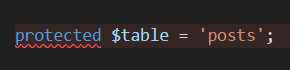

## Ejercico 1- Instalación de Laravel. Definición de las rutas  
  
### Rutas del sitio web  
  
1.  Definir las rutas principales que va a tener nuestro sitio web.  
  
  
2. Uso el comando de artisan que devuelve un listado de rutas para verificar que funciona:  
  
  
3. Lo pruebo también en el navegador:  
  
    
    
## Ejercico 2 - Layout principal de las vistas  
  
1. Crear las vistas asociadas a cada ruta.  
  
  
    
    
## Ejercico 3 - Controladores  
  
1. Añadir los siguientes dos controladores: CategoryController.php y HomeController.php, utilizando el comando de artisan.  
  
  
  
2. Así queda el web.php:  
  
  
3. Acá importo los scripts CategoryController.php y HomeController.php.  
  
  
4. El HomeController es diferente del CategoryController debido a que tiene 1 sola función llamada __invoke y esto hace que no sea necesario agregar el nombre de la función.  
  
  
  
    
## Ejercico 4.1 - Configuración de la base de datos y migraciones  
  
    
## Ejercico 4.2  
  
1. Comando de Artisan para crear el modelo llamado Post.  
  
  
2. Crea el script Post.php en myblog/app/Models/Post.php
  
  
3. ¿Qué hace este modelo?  
Laravel, por convención, asocia el modelo Post con la tabla posts en la base de datos.  
No es necesario indicar el nombre de la tabla si sigo la convención (modelo en singular, tabla en plural). Pero si quiero hacerlo explícito, puedo agregar dentro del modelo:  
  
  
4. Si quiero indicar los campos asignables masivamente (por ejemplo, desde formularios), agrego la propiedad $fillable:  
  
  Esto permite que pueda crear registros facilmente.  
  
  
5. Quedaría así:  
  
  
6. Yo lo dejo vacío.  
  

