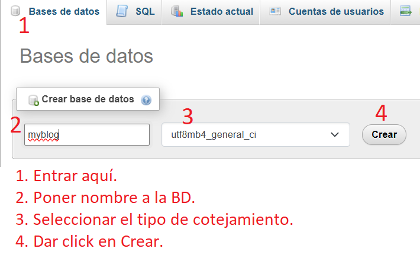
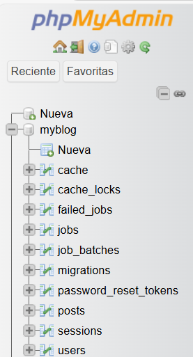
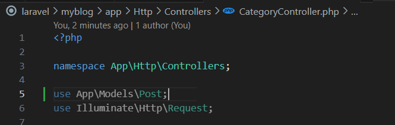
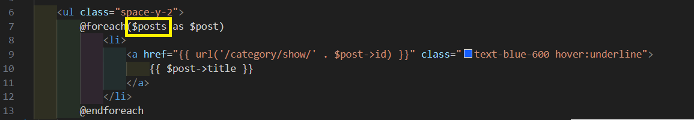

# 
Universidad Nacional del Comahue

# 
Facultad de Informatica

  
# 
Programacion Web Avanzada

  
  
# 
PWA-LARAVEL
  
    

  
  

  
    
    
## Integrantes: 
  * Fuentes Camila FAI-4241  
  * Fuentealba Dario FAI-4424  
  * Riveiro Matías FAI-4438  
    
    
    
# 
Trabajo Práctico N° 3: Laravel
  

  
## Ejercico 1- Instalación de Laravel. Definición de las rutas  
  
### Rutas del sitio web  
  
1.  Definir las rutas principales que va a tener nuestro sitio web.  
  
  
2. Uso el comando de artisan que devuelve un listado de rutas para verificar que funciona:  
  
  
3. Lo pruebo también en el navegador:  
  
    
    
## Ejercico 2 - Layout principal de las vistas  
  
1. Crear las vistas asociadas a cada ruta.  
  
  
    
    
## Ejercico 3 - Controladores  
  
1. Añadir los siguientes dos controladores: CategoryController.php y HomeController.php, utilizando el comando de artisan.  
  
  
  
2. Así queda el web.php:  
  
  
3. Acá importo los scripts CategoryController.php y HomeController.php.  
  
  
4. El HomeController es diferente del CategoryController debido a que tiene 1 sola función llamada __invoke y esto hace que no sea necesario agregar el nombre de la función.  
  
  
  
    
## Ejercico 4.1 - Configuración de la base de datos y migraciones  
  
1. Abrir Xampp y activar Apache y MySQL.  
  
  
2. Entrar a phpmyadmin y crear una base de datos llamada myblog.  
  
  
3. En VSC, dentro de myblog, ir a config/database.php.  
  
   Por defecto se va a conectar a la base de datos sqlite, pero puedo conectarme a otra (mysql, mariadb, pgsql y sqlsrv). Yo voy a conectarme a mysql.  
   Para esto voy al script env (myblog/.env) y busco DB_CONNECTION.    
  

5. Debo colocar estos valores en el script .env.  
  
  
6. Para verificar la correcta conexión con la BD, voy a migrar la tablas de mi proyecto a la BD.  
  

7. Voy a phpmyadmin y verifico que se crearon las tablas en mi BD.  
  
  
8. Si tira error, debo verificar que el cotejamiento que seleccioné al crear la BD sea el mismo que tengo en el script database.php  
  
    
## Ejercico 4.2  
  
1. Comando de Artisan para crear el modelo llamado Post.  
  
  
2. Crea el script Post.php en myblog/app/Models/Post.php
  
  
3. ¿Qué hace este modelo?  
   Laravel, por convención, asocia el modelo Post con la tabla posts en la base de datos.  
   No es necesario indicar el nombre de la tabla si sigo la convención (modelo en singular, tabla en plural). Pero si quiero hacerlo explícito, puedo agregar dentro del modelo:  
  
  
4. Si quiero indicar los campos asignables masivamente (por ejemplo, desde formularios), agrego la propiedad $fillable:  
  
  Esto permite que pueda crear registros facilmente.  
  
  
5. Quedaría así:  
  
  
6. Yo lo dejo vacío.  
  
  
    
## Ejercico 4.3 - Uso de la base de datos  
  
1. En el ejercicio anterior cree el modelo Post - Ver puntos 1 y 2 del ejercicio 4.2.
  
2. Importo el modelo en el controlador.  
  
  
3. Modifico los métodos del controlador.  
  
  
4. Actualizo las vistas.  
  
  
  
  
5. Explico los cambios en la actualización de las vistas.
  
  
   $posts = Post::all(); ---> Obtiene todos los registros de la tabla posts.  
   view('category.index', ..) ---> Carga la vista resources/views/category/index.blade.php  
   compact('posts') ---> Pasa la variable $posts a la vista.
  
   Aquí se usa el modelo Post para acceder a la base de datos.  
   El método ::all() es un método de Eloquent (ORM de Laravel) que hace una consulta SELECT * FROM posts, es decir, trae todos los registros de la tabla posts.  
   El resultado es una colección de objetos de tipo Post.  
  
   return view('category.index', compact('posts'));  
   Esta línea retorna una vista Blade llamada category/index.blade.php (la carpeta y el archivo).  
   compact('posts') es una forma corta de decir:  
   return view('category.index', ['posts' => $posts]);  
   Es decir, le estoy pasando la variable $posts a la vista, para que desde ahí pueda usarla y mostrar los datos.  
  
6. Sigo con la explicación de los cambios.  
  
   $id ---> Recibe el identificador del post.
   Post::findOrFail($id) ---> 	Busca el post por ID. Devuelve error 404 si no lo encuentra.  
   view('category.show', ...) ---> Muestra la vista category/show.blade.php con los datos del post.  
   compact('post') ---> Pasa la variable $post a la vista.  
  
   public function getShow($id)
   Este es un método público llamado getShow, que espera un parámetro $id.
   $id representa el ID del post que quiero mostrar.
   Este método probablemente se asocia a la ruta category/show/{id}  
  
   $post = Post::findOrFail($id);  
   Esta línea busca un registro en la base de datos con el ID que se recibió como parámetro.
   El método findOrFail($id) hace lo siguiente:  
   Intenta hacer SELECT * FROM posts WHERE id = $id LIMIT 1.  
   Si encuentra el post, lo devuelve como un objeto Post.  
   Si NO lo encuentra, Laravel lanza automáticamente un error 404 Not Found.  
   Esto es útil para no tener que comprobar manualmente si existe.  
   Por ejemplo: Si el ID que llega es 5, Laravel va a buscar el post con id = 5. Si existe, lo guarda en $post. Si no existe, devuelve error 404.  

   return view('category.show', compact('post'));  
   Esta línea carga la vista resources/views/category/show.blade.php.  
   Con compact('post') le paso el post encontrado a la vista.  
   Dentro de esa vista puedo acceder a $post->title, $post->content, etc., y mostrarlo.  

7. ¿Qué pasa en la vista?  
  
   En la vista index.blade.php, tengo:  
   Gracias al compact('posts'), esta variable $posts está disponible ahí y puedo recorrerla para mostrar el contenido en HTML.  
  
  
## Ejercicio 5.1- Migración de la tabla usuarios  
  
1. Ejecutar el comando de Artisan que añade las nuevas migraciones.  
   Yo omito este paso porque ya hice las migraciones anteriormente.  
  
  
2. compruebo con PHPMyAdmin que la tabla se ha creado correctamente con todos campos indicados.  
  
  
3. Rellenar la tabla users con los datos iniciales de prueba.  
   Acá tengo 2 opciones, TINKER o SEEDER, voy a usar seeder.  
   Luego de este paso coloco una explicación de cada uno.  
  
4. Decidí utilisar seeder, por lo tanto, corro el siguiente comando que me creará el script UsersTableSeeder.php en myblog\database\seeders\UsersTableSeeder.php.  
  
  
5. Edito el scrip para agregar usuarios, en mi caso, colocare 5.  
  
   El script original es el siguiente:  
  
  
   Lo modifico y queda así:  
  
   Además de los usuarios, agregé las siguientes líneas:  
  
  
6. Ahora agrego el seeder al archivo principal.  
  
  
7. Ejecuto el seeder y verifico en phpmyadmin que se cargaron los datos en la tabla users.  
  
  

   ### Tinker:
   Es una consola interactiva de Laravel basada en el REPL de PHP (PsySH). Permite ejecutar código PHP directamente dentro del entorno de Laravel.  
  
   Ventajas:
   Ideal para probar código rápidamente.  
   No requiere escribir archivos ni guardar nada.  
   Muy útil en fase de desarrollo o depuración.  
  
   ### Seeder:  
   s una clase PHP que define datos de prueba o iniciales para insertar automáticamente en la base de datos. Laravel ejecuta los seeders con el comando php artisan db:seed.
  
   Ventajas:  
   Ideal para llenar la base de datos con datos repetibles y automatizados.  
   Se puede versionar y compartir con el equipo.  
   Muy útil cuando querés poblar varias tablas a la vez o preparar datos al desplegar la app.  
  
   ### Comparación directa  
   Característica	        Tinker	                      Seeder  
   Uso	                  Manual, interactivo	          Automático, programado  
   Velocidad	            Muy rápido para una prueba	  Más lento pero repetible y reutilizable  
   Persistencia	          No se guarda el código	      Se guarda como archivo en database/seeders  
   Ideal para	            Pruebas rápidas	              Llenar base de datos inicial o en producción  
   Parte de despliegue	  No	                          Sí (se puede correr en servidores)  
  